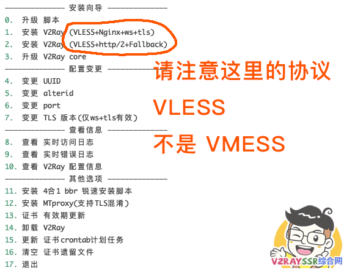
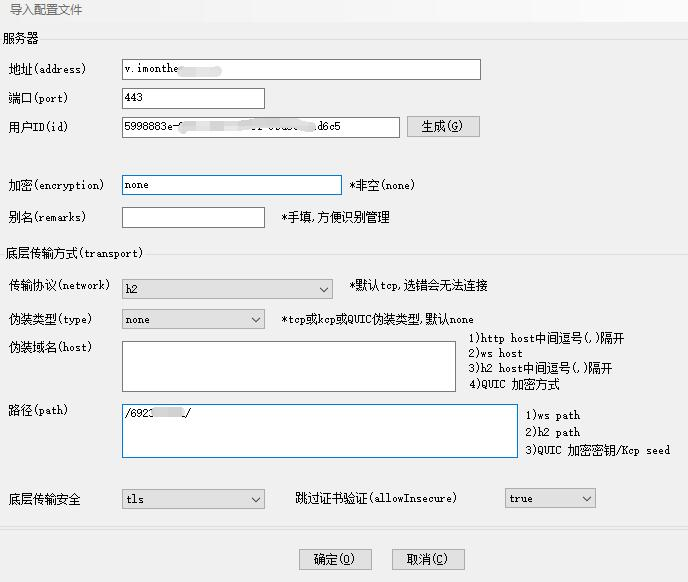

# V2FLY一键安装

**准备工作**

1，购买域名和VPS，做好域名A记录，一键安装过程需要填写域名。 

2，电脑上装好Xshell 软件，（终端编码设置为：Unicode\(UTF-8\)）

3，使用Xshell 远程登录VPS（如果使用的是GCP，请参考[https://yunbotao.gitbook.io/notes/xue-xi-bi-ji/yong-ssh-gong-ju-xshell-lian-jie-gu-ge-yun-root-yong-hu-huo-pu-tong-yong-hu](https://yunbotao.gitbook.io/notes/xue-xi-bi-ji/yong-ssh-gong-ju-xshell-lian-jie-gu-ge-yun-root-yong-hu-huo-pu-tong-yong-hu)）

**服务器端**

```text
systemctl start firewalld && firewall-cmd --zone=public --add-port=22/tcp --permanent && firewall-cmd --reload
systemctl start firewalld && firewall-cmd --zone=public --add-port=443/tcp --permanent && firewall-cmd --reload
```

```text
yum install -y git && yum install -y wget #CentOS安装命令
apt install -y git #Debian安装命令
```

```text
wget -N --no-check-certificate -q -O install.sh "https://raw.githubusercontent.com/wulabing/V2Ray_ws-tls_bash_onekey/dev/install.sh" && chmod +x install.sh && bash install.sh
```



查看配置信息

```text
cat v2ray_info.inf
```

**客户端**

1，解压v2rayN.zip和v2ray-windows-64.zip

2，将v2ray-windows-64里的内容复制粘贴替换到v2rayN里

3，点击v2rayN.exe启动客户端



**下载链接和教程参考**

\*\*\*\*[https://github.com/2dust/v2rayN/archive/master.zip](https://github.com/2dust/v2rayN/archive/master.zip)

\*\*\*\*[https://github.com/v2ray/v2ray-core/releases](https://github.com/v2ray/v2ray-core/releases)

\*\*\*\*[https://www.v2rayssr.com/vless.html](https://www.v2rayssr.com/vless.html)

