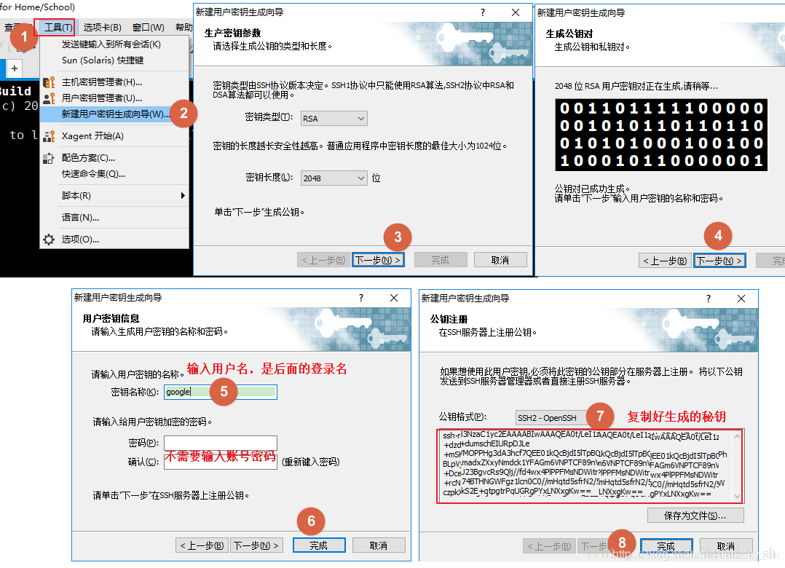
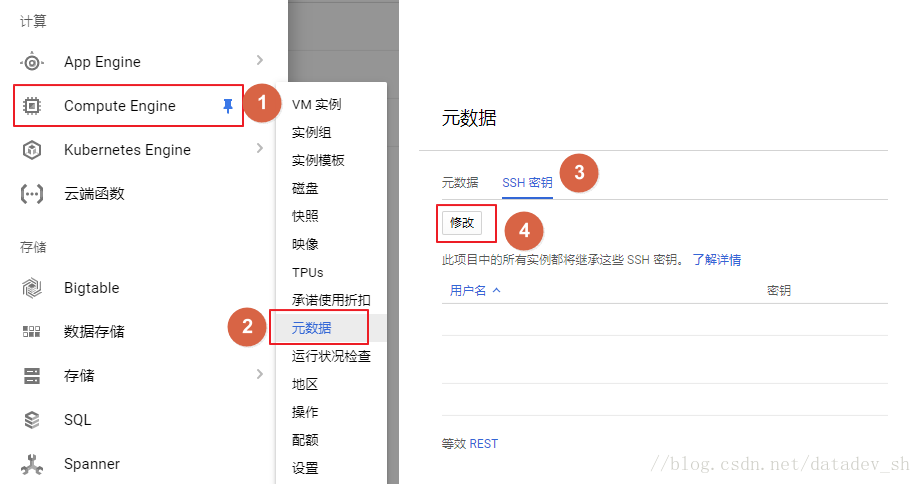
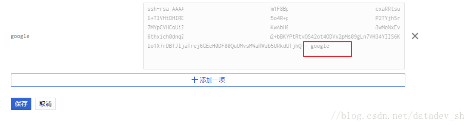
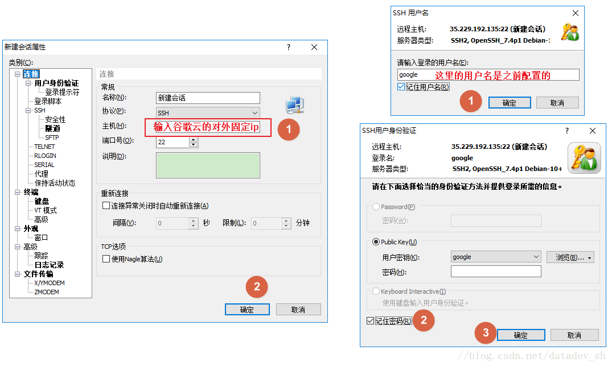

# 用SSH工具XShell连接谷歌云 root用户或普通用户

### 1. 本地用xshell生成密秘钥



### 2. 将秘钥配置到谷歌云上

```text
菜单 — 计算引擎 — 元数据 — SSH秘钥 — 修改 — 添加一项
```



```text
粘贴刚才从xshell复制的秘钥。在末尾添加 [空格][用户名] 这里就是“ google”，保存即可。
```



### 3. 用xshell连接



连上之后，输入命令

```text
sudo -i
```

切换到root用户. 

原文链接：[https://blog.csdn.net/datadev\_sh/article/details/79593360](https://blog.csdn.net/datadev_sh/article/details/79593360)

